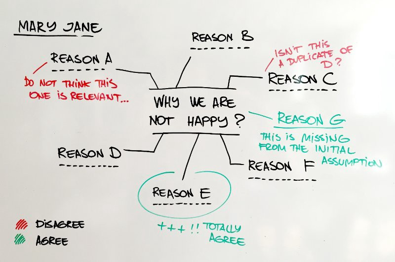
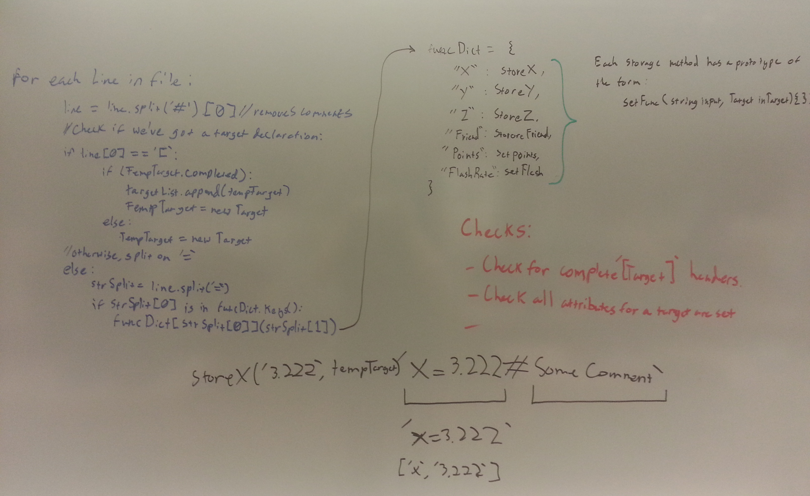
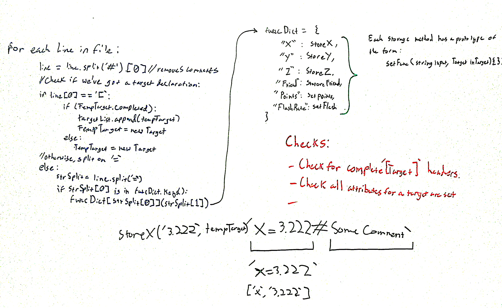

# Extensive list of Image enhancement methods implementation in Python

Currently have implemenatations for
- Chromatic Adaptation
- Retinex Image Enhancement
- Whiteboard Image Enhancement

### How to run?
Every implemenation is separated in each directory with a respective script file. Run the script files to process the image.

---

## Chromatic Adaptation

Read about the algorithm and implementation in my blog post [Image Enhancement using Retinex Algorithms](https://santhalakshminarayana.github.io/blog/retinex-image-enhancement)

---

## Retinex Image Enhancement

Read about the algorithm and implementation in my blog post [Color constancy of an image using Chromatic adaptation](https://santhalakshminarayana.github.io/blog/chromatic-adaptation)

---

## Whiteboard Image Color Enhancement

Enhance whiteboard images by applying image-processing techniques. Whiteboard image color enhancement is based on this [ImageMagick command line gist](https://gist.github.com/lelandbatey/8677901)

Converted following ImageMagick commands to **Python** and **OpenCV** by applying enhancement functions like
- Difference of Gaussian (DoG)
- Contrast Stretching
- Gamma Correction

```bash
-morphology Convolve DoG:15,100,0 -negate -normalize -blur 0x1 -channel RBG -level 60%,91%,0.1
```
Run **whiteboard_image_enhance.py** by passing _input_ and _output image path_

```shell
$ python whiteboard_image_enhance.py -i input.jpg -o output.jpg
```

> Checkout the details in my article [Whiteboard image enhancement using OpenCV](https://santhalakshminarayana.github.io/blog/whiteboard-image-enhancement-opencv-python)

### Results

<table border='0'>
  <tr>
    <th>Original</th>
    <th>Enhanced</th>
  </tr>
  <tr>
    <td></td>
    <td></td>
  </tr>
  <tr>
    <td></td>
    <td></td>
  </tr>
  <tr>
    <td></td>
    <td></td>
  </tr>
  <tr>
    <td></td>
    <td></td>
  </tr>
</table>
